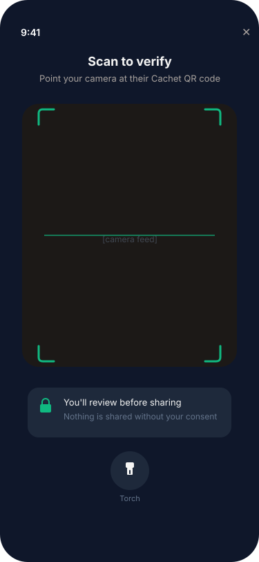
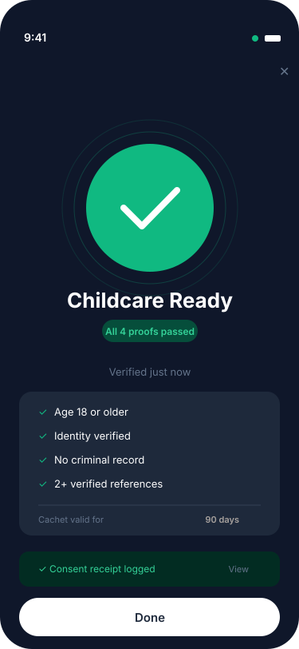

# Cachet

> **Prove what matters, nothing more. Don't take their word for it.**

You're hiring a babysitter you found online. The platform says she's "verified" -- but verified how? By whom? You never see the evidence. You just... trust the platform. Now flip it: you're selling a vintage watch to a stranger. They want proof you're legit, so you hand over your ID, your address, your transaction history. They get everything. You get nothing back.

This is the trust paradox of the modern internet. Trust is more necessary than ever -- we transact, hire, and collaborate with people we've never met -- yet harder to get right. We're forced to delegate due diligence to platforms that operate as black boxes, with no transparency into what was actually checked, or we're forced to over-share personal data just to prove a single fact.

Cachet exists for the **net citizen who takes trust into their own hands**.

When you need to verify someone -- a caregiver for your children, a seller on a marketplace, a freelancer for a sensitive project -- Cachet lets you **demand cryptographic proof** of exactly what matters. Not their birthdate, just that they're over 18. Not their referee's names, just that they have two or more verified references. Not their full transaction history, just that their fulfilment rate exceeds 95%.

When you need to prove something about yourself, Cachet lets you do it **without giving yourself away**. Your credentials live on your device. You choose what to share, with whom, and you get a signed receipt every time.

No platform in the middle deciding what "verified" means. No data sitting on someone else's server. Just **math, consent, and transparency**.

---

## The wallet

Cachet is a mobile wallet where **verification starts with the person who demands trust** -- the verifier. The holder (the person being verified) responds on their own terms. Every interaction is local-first, end-to-end signed, and leaves a transparent audit trail.

<table>
<tr>
<td align="center" width="25%">
<br/>
<strong>1. Demand trust</strong><br/>
<em>Onboarding teaches the verifier-first mindset: don't take their word for it.</em>
</td>
<td align="center" width="25%">
<br/>
<strong>2. Pick a Cach'Pack</strong><br/>
<em>The verifier selects a <strong>Cach'Pack</strong> -- a reusable bundle of checks for a context.</em>
</td>
<td align="center" width="25%">
<br/>
<strong>3. Scan & verify</strong><br/>
<em>The holder scans a QR code and approves disclosure. Verification happens locally on-device.</em>
</td>
<td align="center" width="25%">
<br/>
<strong>4. Instant result</strong><br/>
<em>A <strong>cachet</strong> is earned -- a time-boxed, contextual proof. A consent receipt is logged.</em>
</td>
</tr>
</table>

## Key concepts

| Concept | What it is |
|---------|------------|
| **Cachet** | The verification outcome -- a time-boxed, contextual credential (e.g., "Childcare-Ready (ES) -- valid 90 days"). Think of it as an SSL certificate, but for people. |
| **Cach'Pack** | A reusable set of checks for a specific context (e.g., "Childcare Readiness", "Safe Seller"). Packs define *what* must be proven, not *how*. |
| **Predicate** | A property proven without revealing the raw attribute. `age >= 18`, not a birthdate. `>= 2 references`, not names. |
| **Consent Receipt** | A signed record of what was proven, to whom, and why. Hash-anchored to a transparency log so anyone can audit. |
| **Transparency Log** | An append-only Merkle tree. Receipts exist, haven't been tampered with, and can be independently verified. |

### Verification protocol

The verifier's device does the heavy lifting -- no backend in the critical path:

```
Verifier                          Holder                        Transparency Log
  |                                  |                                |
  |-- signed request (QR/link) ----->|                                |
  |                                  |-- reviews & approves           |
  |<-- signed presentation ---------|                                |
  |                                  |                                |
  |  local: verify signature,        |                                |
  |  evaluate predicates,            |                                |
  |  check freshness & revocation    |                                |
  |                                  |                                |
  |-- cachet + consent receipt ----->|                                |
  |                                  |-- receipt hash --------------->|
  |                                  |                                |
```

Six non-negotiable principles govern this flow: **local verification** (signature checks on-device), **verifier-first** (the person demanding trust is primary), **untrusted transport** (relay is a dumb pipe, end-to-end encrypted), **minimal disclosure** (only requested claims), **holder consent** (explicit approval before data leaves the device), and **cryptographic proof** (every claim backed by verifiable signatures).

See [Verification Protocol](docs/VERIFICATION_PROTOCOL.md) for the full specification.

## Architecture

Four backend services, one mobile wallet. All PII stays on the holder's device; servers handle only policy, proofs, and audit primitives.

| Service | Purpose | Port |
|---------|---------|------|
| **Verifier** | Validates Cach'Pack presentations against signed policies | 8081 |
| **Registry** | Signed, versioned pack and policy definitions | 8082 |
| **Receipts Log** | Consent receipts + transparency log | 8083 |
| **Issuance Gateway** | Converts Veriff identity checks into SD-JWT Verifiable Credentials via OpenID4VCI | 8090 |

The **Cachet Wallet** (Android, Kotlin Multiplatform) holds credentials, plans proofs locally, and can both present credentials and request verification from peers.

See [Architecture](docs/ARCHITECTURE.md) for the full system design.

## Cach'Packs

| Pack | Context | Predicates |
|------|---------|------------|
| Childcare Readiness | Caregiver onboarding | age >= 18, ID + liveness verified, clean background check, >= 2 verified references |
| Safe Seller | Marketplace trust | ID verified, platform tenure >= 6 months, fulfilment rate >= 95%, no unresolved chargebacks |

Pack definitions with jurisdictional variants (FR, EE, ES) are in [docs/PACKS/](docs/PACKS/).

## Quick start

```bash
devenv shell                          # enter dev environment
devenv shell -- dev:services          # start all backend services
devenv shell -- test:all              # run unit tests
devenv shell -- android:run           # full setup: backend + Android app
```

After pulling `.envrc` changes, run `direnv allow` once. If shell startup seems stuck, run `./scripts/diagnose-devenv-shell.sh`.

## Documentation

### Project references

| Document | Description |
|----------|-------------|
| [Vision](docs/VISION.md) | Customer story, core concepts, product flows |
| [Architecture](docs/ARCHITECTURE.md) | System design, layers, security model, tech stack |
| [Verification Protocol](docs/VERIFICATION_PROTOCOL.md) | Local-first protocol, relay design, trust model, cryptographic requirements |
| [Transparency Log](docs/TRANSPARENCY_LOG.md) | Merkle log design for consent receipt auditing |
| [Business Model](docs/BUSINESS_MODEL.md) | Pricing, adoption levers, moat, no-data-brokerage boundary |
| [Health Endpoints](docs/HEALTH_ENDPOINTS.md) | Why `/health` not `/healthz` (Cloud Run constraint) |
| [Policy Manifest](docs/POLICY_MANIFEST.yaml) | Signed governance charter: consent, minimum disclosure, no global scores |

### Internal working documents

Planning, roadmaps, and engineering status trackers live in [`docs/internal/`](docs/internal/):

| Document | Description |
|----------|-------------|
| [Roadmap](docs/internal/ROADMAP.md) | Build phases, success metrics, exit criteria |
| [Refactoring Plan](docs/internal/REFACTORING_PLAN.md) | March 2026 code review outcomes and cleanup phases |
| [CI Optimization](docs/internal/CI_OPTIMIZATION.md) | Caching strategy and build performance notes |

## Standards

Built on open standards for interoperability:

- **W3C Verifiable Credentials 2.0** -- portable credential format
- **SD-JWT VC** -- selective disclosure (prove predicates without revealing attributes)
- **OpenID4VCI / OpenID4VP** -- standard issuance and presentation protocols
- **DIDs** -- decentralized identifiers with key rotation
- **StatusList2021** -- privacy-preserving revocation

## Project status

| Layer | Status |
|-------|--------|
| Issuance Gateway | Working -- Veriff webhook to SD-JWT VC via OpenID4VCI |
| Mobile Wallet | Working -- credential vault, issuance flow, consent receipts, Compose UI |
| Verifier | Stub -- returns hardcoded responses; deterministic policy engine planned |
| Registry | Working -- serves signed policy manifest |
| Receipts Log | Stub -- backend transparency log planned |
| BBS+ / ZK-SNARKs | Planned -- Phase B |
| iOS Wallet | Planned |

## Contributing

We welcome contributions. Here's how to get started and submit high-quality work.

### Prerequisites

- [devenv](https://devenv.sh) -- manages all dependencies including Go, Android SDK, and tooling
- An Android emulator (created via `devenv shell -- android:emulator`)

### Getting started

```bash
git clone <repo-url> && cd cachet
devenv shell                              # enter dev environment (installs everything)
devenv shell -- dev:services              # start backend services
devenv shell -- android:run               # build and launch the Android app
devenv shell -- test:all                  # run the full test suite
```

### Development workflow

1. **Branch from `main`**: `git checkout -b feature/your-feature`
2. **Schema first**: API changes start in `schemas/openapi.yaml` -- validate with `schema:validate`, generate with `schema:generate`, sync with `schema:sync`
3. **Write tests first** (TDD): prove the behaviour before implementing it
4. **Format and lint**: `devenv shell -- fmt:go` and `devenv shell -- lint:go` before every push
5. **Run the full suite**: `devenv shell -- test:all` and `devenv shell -- android:test-unit`

### Quality gates

Every PR must pass:

- **Schema validation** -- OpenAPI spec is valid and generated models are in sync
- **All tests green** -- unit, integration, and schema tests
- **Linting clean** -- `golangci-lint`, `prettier`, `gofmt`
- **Security checks** -- no new vulnerabilities introduced
- **Conventional commits** -- clear, scoped commit messages (`feat:`, `fix:`, `refactor:`, etc.)

### Commit hygiene

- **One concern per commit** -- don't mix a bug fix with a refactor
- **One focus per branch** -- keep PRs reviewable
- **Never commit secrets** -- `.env`, credentials, API keys stay out of version control
- **Run `devenv shell -- pre-commit run`** before pushing to catch issues early

### Where to look

| Area | Path |
|------|------|
| Backend services | `services/verifier/`, `services/registry/`, `services/receipts-log/`, `services/issuance-gateway/` |
| Shared Go module | `services/common/` |
| Android wallet | `mobile/androidApp/` |
| Shared KMM logic | `mobile/shared/` |
| API specifications | `api/` |
| Cach'Pack definitions | `docs/PACKS/` |
| Design assets | `design/` |

### Getting help

Open an issue or check the [documentation table](#documentation) above. For architecture questions, start with [ARCHITECTURE.md](docs/ARCHITECTURE.md). For protocol questions, start with [VERIFICATION_PROTOCOL.md](docs/VERIFICATION_PROTOCOL.md).

## License

Apache-2.0
